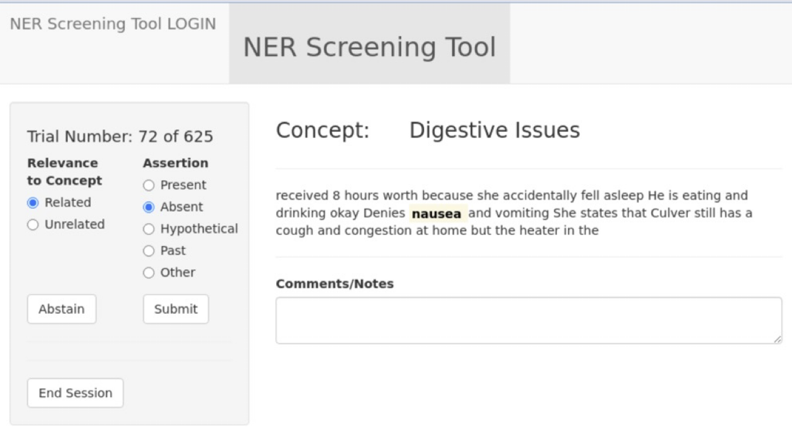

# ScreenTool 7.2

ScreenTool is a user interface designed to facilitate the review
(typically by SMEs) of text that has entities already tagged by an NER
process. It allows the SME to review the entity within a restricted
context and assign one of several assertions to the entity.  As shown
below, the interface permitted SMEs to indicate the relevance (binary
choice) of the highlighted term to a Long COVID feature (termed
“Concept” in the interface) and assign one of five assertion tags to
the feature. If there is insufficient information available in the
note context to assign an assertion tag, SMEs are permitted to abstain
from providing one, in which case an assertion label of “noCall” is
assigned to indicate that no specific assertion was obtained on the
trial. The noCall label is also used for cases where the NER models
did not identify an entity for the JSL assertion model. Terms
classified as “Not Relevant” by SMEs are assigned an assertion tag of
“badCall” for analysis purposes.

